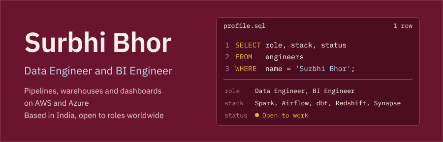
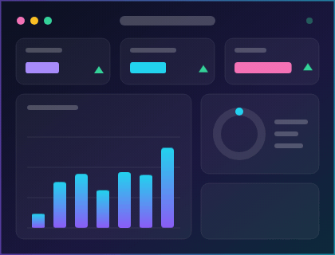

  

  
  
  

### About me

> *I turn raw, messy data into pipelines, warehouses, and dashboards that people can trust.*

- 🔭 **What I build:** end-to-end data platforms, from raw ingestion and Spark transformations to star-schema warehouses and the dashboards decisions run on

- 🏢 **Where I've built it:** Amazon Grocery (Whole Foods Market), BCG, and Capgemini

- ☁️ **My toolbox:** AWS (Redshift, Glue, Lambda, S3, QuickSight), Azure (Synapse, Data Factory, Data Lake Gen2), Spark, Airflow, dbt, Tableau, and Power BI

- 🤖 **How I work:** AI-assisted data engineering, pairing with agentic coding tools (Cursor, Claude, GitHub Copilot) to design and build pipelines, refactor transformations, map lineage out of legacy SQL, and triage incidents faster

- ⚡ **What I geek out on:** dimensional modeling, Spark tuning, and shaving minutes off slow queries

- 🌱 **Right now:** shipping hands-on data engineering and BI projects during this transition period to keep my skills sharp

- 🎓 **Education:** Master's in Information Management, University of Illinois Urbana-Champaign (May 2024)

- 🎯 **Looking for:** Data Engineer and BI Engineer roles, based in India and open to opportunities worldwide

- 📫 **Reach me:** work.surbhibhor@gmail.com

 

### Tech stack

  
  
  
  
  
  

  
  
  
  
  
  

  
  
  
  
  
  

### Featured projects

<table>
  <tr>
    <td width="50%" valign="top">
      <h4><a href="https://github.com/surbhi-bhor/StadiumsETL">StadiumsETL</a></h4>
      
Airflow pipeline that pulls stadium data from Wikipedia into Azure Data Lake Gen2, then through Data Factory and Synapse Analytics to a Tableau dashboard.

      
      
      
    </td>
    <td width="50%" valign="top">
      <h4><a href="https://github.com/surbhi-bhor/instacart-market-basket-analysis">Instacart Market Basket Analysis</a></h4>
      
Star-schema model and exploratory analysis of customer behavior and product performance, visualized in a Tableau dashboard.

      
      
      
    </td>
  </tr>
</table>

  

